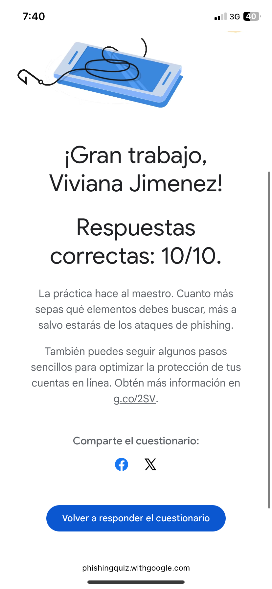

# Tareas

## Primera Clase

11-08-25
Primer día de clase, el Maestro nos comentó la manera en que calificaría, 30 examen, 30 tareas, 30 proyecto y 10 asistencia.
Nos pidió que lo agregaramos en Discord para poder estar en el grupo de tareas de la Universidad, nos comentó que debíamos crear una cuenta en Discord, en Github y en este mismo nuestro repositorio. Nos dijo que en MARKDOWN debiamos llevar nuestra bitácora de todo lo que hagamos en las clases. Nos dejó investigar sobre la ingeniería social.

## Segunda Clase 

14 -08- 25
Creamos nuestra cuenta de Discord, Github y en este mismo nuestro Repositorio llamado "Portafoliotallerdecomputacion" donde subiremos las tareas completadas.
Comentamos el concepto de Ingeniería social. Realizamos el quiz de Phishing.

## Tercera Clase

18-08-25
Nos intentamos registrar en el Programa Github for Education, pero lastimosamente no captaba bien mi información, por lo que intente varias veces subir mis datos y no me logró aceptar😢. Hasta el 3er intento que fue aceptado 1 día después.

## Tarea 997

21-08-25
Creamos bitácora de clase Usando MarkDown.
Nos dio una guía sobre como poner algunos elementos en nuestro apartado Markdown como por ejemplo, el tamaño que tendrá algún texto depende de cuántos gatitos # se utilicen, también nos muestra como pegar enlaces e imágenes que estan subidas de nuestro repositorio al MARKDOW.
El maestro igual nos comentó que debiamos hacer nuestro currículum en formato word o canva, tenía que estar en español e inglés. Toda la Clase nos la pasamos buscando formatos presentables y pensando en las áreas que somos buenos para agregarlo.

## Quinta Clase

25-08-25
Llegando al salón de clases, nos dimos cuenta que no servían los aires acondicionados, por lo que el maestro solamente paso lista y nos encargó avanzar con nuestro currículum. 

## Tarea 998
14-08-25 Realizamos un Quiz, relacionado con el concepto antes investigado "Ingeniería Social", que era tratar de ver si los formatos eran Reales o son para robar información.

## Tarea 996 
28-08-25 Realizamos nuestro currículum, en español e inglés, con nuestras Soft skills y nuestras Hard skills, que son nuestras habilidades que hacemos mejor.

Puedes consultar mi currículum aquí:  
[currículum](curriculum.pdf)

## Clase 01-09-25

Llegando al salón de Clases, el maestro nos comentó que no estaría en Clase unos días, por lo que firmamos un papel de que estábamos de acuerdo. Nos comentó las 2 actividades nuevas por entregar en esas semanas que eran "Seguir una guía de Word y documentar todo con fotos y palabras" y "Crear nuestro dominio" 

## Clase 04-09-25

Mis compañeros habían comentado con anterioridad que el maestro
no llegaría ese día, por lo que todo el salón no asistió.
Perdóneme profe, ya no confiaré en los humanos, no me ponga falta😢🙏🏽
 
## Clase 08-09-25

Intentamos crear nuestro dominio, pero no nos acepta por falta de relación con la universidad, por lo que mandamos un "reporte" con nuestra información y la de la universidad para que nos lo pueda aceptar.
Avanzamos con algunas actividades que son capturar pasos de Word.

## Clase 11-09-2025

No tuvimos clases con el maestro, por lo que avanzamos un poco más en nuestras tareas pendientes.

## Clase 15-09-2025

Intentamos hacer nuestro sitio web, por milésima vez, yo no pude hacerlo bien😭, los códigos se me movían pero intente como 100 veces cambiarlo para que quede bien, pero no she pudo🥲.

## Tarea 995
Seguimos una guía de Word, en la que veíamos y poníamos en práctica todos las utilidades que nos da Word, como imprimir, crear un nuevo documento, guardarlo, etc. 
[Prácticaword](https://github.com/Vivianajim1/Portafoliotallerdecomputacion/blob/main/practica1.md)
## Tarea 994
En esta actividad creamos nuestro sitio web, yo intente crear el mío personal, pero tuve demasiados problemas para hacerlo correctamente y corregir erroes. No lo hice bien la verdad pero trate de hacerlo lo más bien que se pudiera. [Sitioweb](https://vivianajim1.github.io/)
