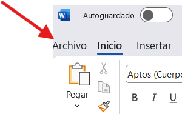

# PRÁCTICA 1 WORD

Microsoft Word es un programa que sirve para escribir y dar formato a textos. Con él puedes crear cartas, tareas, informes, currículums y muchos más documentos. 

Abrir Microsoft Word 2016:	
1.	Haz clic en el Menú Inicio de tu computadora
2.	Haz clic en Todos los programas
3.	Elige Microsoft Office
4.	Haz clic en Microsoft Word 2016
 Se abrirá una hoja en blanco lista para trabajar.

Todo Microsoft Office 2016 contiene el área Backstage. El Backstage es donde gestionas, guardas y abres tus archivos. Aquí también puedes imprimir, seleccionar plantillas y realizar otras tareas útiles.
Primero, haz clic en la pestaña Archivo (que se encuentra en la esquina superior izquierda de la ventana).

## La primera página que verás es la Página de INFORMACIÓN.
La sección Información muestra el nombre, tamaño y autores de tu archivo. También puedes ver cuándo se realizó el último AutoGuardado. Los AutoGuardados son la red de seguridad de Office. Tu computadora guardará automáticamente tu archivo como un archivo temporal. Si tu computadora se apaga inesperadamente, puedes recuperar parte de tu trabajo a partir de los AutoGuardados

## Opciones del Backstage:
1. Nuevo: Puedes crear un documento nuevo y en blanco o seleccionar una plantilla de la biblioteca de Word. Word proporciona plantillas para currículums, calendarios y folletos para ayudarte a comenzar.
2. Abrir: Haz clic en esta opción para abrir un archivo previamente guardado y continuar editándolo.
3. Guardar: Guarda tu archivo con frecuencia. También puedes hacer clic en el ícono en la esquina superior izquierda o presionar CTRL + S en tu teclado al mismo tiempo.
4. Guardar como: La primera vez que guardes tu archivo, verás el menú Guardar como. Guarda tu trabajo en tu computadora o en la nube (OneDrive).
5. Guardar como Adobe PDF: Te permite guardar el documento como un archivo PDF de Adobe.
6. Imprimir: Imprime tu documento desde esta pantalla. Manda tu archivo a la impresora.
7. Compartir: Esto es nuevo en Office 2016. Permite enviar tu archivo por correo electrónico, subirlo a un sitio de blog o presentar tu documento en línea. 
8. Exportar: Permite exportar (o guardar) tu documento como otro tipo de archivo, como PDF.
9. Cuenta: Permite cambiar los colores del fondo de Office e iniciar sesión con una cuenta de Microsoft diferente si es necesario.
10. Opciones: Da acceso a las funciones avanzadas de Word. Esta opción también permite reorganizar la cinta de opciones u otros ajustes de la aplicación.
 
 

Para regresar a la ventana de Word, haz clic en la flecha en la parte superior. 

## La Cinta de Opciones 
Es un panel que contiene agrupaciones funcionales de botones y listas desplegables organizadas por pestañas. Cada producto de la suite de Office tiene un conjunto de pestañas relacionadas con la funcionalidad de esa aplicación. Cada pestaña se divide a su vez en grupos, como Fuente y Párrafo.

En la esquina inferior derecha de algunos grupos, hay una flecha diagonal llamada Iniciador de cuadro de diálogo. Al hacer clic en este botón, se abre un cuadro de diálogo para ese grupo que contiene opciones adicionales relacionadas con el grupo. 

Las pestañas contextuales aparecerán según en qué estés trabajando. Por ejemplo, si has insertado imágenes, la pestaña aparecerá cada vez que se seleccione una imagen. 

## Personalización de la Cinta de Opciones
Puedes ocultar o mostrar pestañas que no utilices, o crear tu propia pestaña con tus herramientas favoritas. Te explico cómo personalizar la Cinta de Opciones para crear tus propias pestañas y grupos.
Haz clic en la pestaña Archivo.

## Pestaña Archivo (Vista Backstage)

* En la Vista Backstage, haz clic en Opciones.
*  En el cuadro de diálogo Opciones de Word, haz clic en Personalizar cinta de opciones.
* Haz clic en el botón Nueva pestaña.
* Se agregará una Nueva pestaña en la lista de pestañas principales. Debajo de Nueva pestaña, verás que Nuevo grupo ya está seleccionado para ti.
* Desde la columna de la izquierda, selecciona un comando de la lista en Elegir comandos de para agregarlo al Nuevo grupo.
* Haz clic en el botón Agregar. El comando se agregará a tu pestaña Nuevo grupo.
* Para renombrar la pestaña o el grupo, haz clic derecho sobre Nueva pestaña o Nuevo grupo.
* Haz clic en Cambiar nombre.
* Para ocultar una pestaña, quita la marca de verificación junto al nombre de la pestaña.
    
  
 
 

## Barra de herramientas de acceso rápido

La Barra de herramientas de acceso rápido se encuentra en la parte superior izquierda de la ventana principal de Word, encima de las pestañas Archivo e Inicio. Permite acceder fácilmente a los comandos que usas con frecuencia y se puede personalizar:
1.	Haz clic en la flecha desplegable de la Barra de herramientas de acceso rápido.
2.	En el menú desplegable, selecciona los comandos que desees agregar o quitar.
3.	Haz clic en Más comandos.
4.	En la ventana Personalizar Barra de herramientas de acceso rápido, selecciona un comando de la columna de la izquierda.
5.	Haz clic en Agregar.
6.	Haz clic en Aceptar.
   
 
 
 

Otras partes de la Cinta de Opciones
En la parte superior de la cinta hay varias pestañas; al hacer clic en una pestaña, se muestran varios grupos de comandos relacionados:

Inicio: Contiene los comandos más utilizados en Word, como cambiar el formato del texto y los comandos Cortar, Copiar y Pegar.

Insertar: Contiene comandos para insertar objetos como imágenes, tablas y formas en el documento.

Diseño: Permite cambiar el aspecto del documento y agregar elementos visuales.

Diseño de página: Permite cambiar la posición del texto en la página y el formato del documento.

Referencias: Permite gestionar fuentes y citas, así como agregar tablas de contenido y notas al pie.

Correspondencia: Permite configurar y usar la función de Combinar correspondencia de Word.

Revisar: Esta pestaña permite usar la revisión ortográfica y gramatical, insertar comentarios, realizar un seguimiento de los cambios hechos en el documento y usar un diccionario de sinónimos.

Vista: En esta pestaña puedes cambiar la forma en que se ve la ventana de Word. 

 

## La barra de título

Junto a la Barra de herramientas de acceso rápido se encuentra la Barra de título. Muestra el nombre del documento en el que estás trabajando actualmente. Word nombra el primer documento nuevo que abres como “Documento1” hasta que lo guardes y le des un nuevo nombre.

La regla se encuentra debajo de la cinta de opciones. Usando la regla, puedes ajustar de manera eficiente los márgenes de la página y las sangrías de los párrafos.

 

## Área de texto

Justo debajo de la regla hay un área grande para trabajar. La línea vertical parpadeante en la esquina superior izquierda del área de texto es el cursor, que indica el punto de inserción. A medida que escribes, tu texto aparecerá en la ubicación del cursor.

## La barra de estado

Aparece en la esquina inferior izquierda de Word. La barra de estado muestra la página actual y el recuento de palabras de tu documento. Puedes personalizar lo que se muestra en la barra de estado.

## Vistas de documento

En Word 2016, puedes mostrar tu documento con una de las siguientes cinco vistas: Borrador, Diseño Web, Diseño de impresión, Modo de lectura o Esquema. Estas opciones se encuentran en la pestaña Vista.

1. Vista Borrador: La vista Borrador elimina los espacios innecesarios. No podrás ver los márgenes ni el diseño de página.
2. Diseño Web: Permite ver tu documento tal como aparecería en un navegador web, como Internet Explorer.
3. Diseño de impresión: Muestra todo, desde los márgenes hasta el diseño de la página. Es la vista más común, ya que muestra cómo se verá el documento al imprimirse.
4. Modo de lectura: Permite ver cómo se ve tu documento en un formato de dos páginas. Es ideal para comprobar cómo se verá el documento en dispositivos como tabletas. No puedes editar el documento en esta vista.
5. Vista de esquema: Muestra el documento en forma de esquema. Puedes ver solo los encabezados sin el texto. Si mueves un encabezado, el texto asociado se mueve con él.

 
## CREAR Y GUARDAR UN DOCUMENTO

Una vez que abras Word 2016, habrás iniciado un documento nuevo. Verás una página en blanco y un cursor parpadeante.
Antes de comenzar o poco después, debes guardar tu documento. Guardar un documento con frecuencia evita la pérdida de archivos si tu computadora se apaga inesperadamente. En este punto, puedes comenzar a ingresar texto. Es posible que necesites varias sesiones en Word para completar la versión final de documentos largos o complejos.
Cuando escribes texto en un documento de Word, cada carácter aparece a la izquierda del punto de inserción parpadeante (el cursor) en la ventana del documento. El texto que ingreses puede incluir letras, espacios, números y símbolos. A medida que escribes, el punto de inserción se mueve a través de la pantalla de derecha a izquierda. 

Guardar un documento

El menú Guardar como aparece la primera vez que guardas un archivo. También puedes usar este menú para guardar diferentes copias del mismo archivo, asignando a cada copia un nombre ligeramente distinto. Esto se puede hacer en cualquier momento.
Puedes guardar tu archivo antes, durante o después de haber terminado tu sesión. Para guardarlo debes:
Abrir la pantalla Guardar como
Por defecto, tienes dos lugares donde puedes guardar tu archivo:

1.	Directamente en tu computadora
2.	En una cuenta de OneDrive

Tu cuenta de OneDrive es un servicio de almacenamiento en la nube donde puedes guardar tu archivo en los servidores de Microsoft en lugar de tu computadora. Esta opción te permite acceder a tus archivos desde cualquier computadora con acceso a Internet. Para este curso, no usaremos OneDrive; solo guardaremos el archivo en la computadora.
A menos que quieras usar una cuenta de OneDrive, guardarás la mayoría de tus archivos en la computadora.

Desde la pantalla Guardar como:
1.	Selecciona Esta PC
2.	Haz clic en Examinar

 
 
También puedes usar el cuadro de diálogo Guardar como para guardar diferentes copias del mismo archivo, asignando a cada copia un nombre ligeramente distinto.
1.	Cuadro de Nombre de archivo: Word insertará automáticamente un nombre de archivo predeterminado la primera vez que guardes un documento. Este nombre predeterminado suele ser la primera frase del documento, aunque puedes modificarlo. Word puede manejar nombres de archivo de hasta 255 caracteres. Estos nombres pueden incluir letras mayúsculas y minúsculas, números e incluso espacios.
Sin embargo, no pueden contener los siguientes símbolos: < > : * | \" ? /
2.	Ruta del archivo: En la parte superior del cuadro, puedes ver la ruta del archivo del documento. La ruta del archivo muestra en qué carpetas se guardará el documento.
3.	Ubicación del archivo: La ubicación predeterminada donde se guardará el documento es Mis documentos. Para guardar el documento en otra ubicación (incluyendo memorias USB), puedes hacer clic en la carpeta o unidad en el lado izquierdo del cuadro de diálogo Guardar como.
4.	Archivos similares: Al guardar un documento, se mostrarán archivos de tipos similares. Por ejemplo, si guardas un documento de Word 2016, verás listados otros documentos de Word 2016 (.docx).
5.	Nueva carpeta: Podrías considerar crear una nueva carpeta antes de guardar tu archivo. Esto ayudará a organizar tus documentos.
6.	Tipo de archivo: Al guardar un archivo, también puedes cambiar su formato. Por ejemplo, puedes guardarlo como PDF (formato de documento protegido) o como Documento de Word. Haz clic en el cuadro desplegable para seleccionar el tipo que prefieras. El tipo de archivo se indica mediante la extensión del nombre del archivo (pdf, doc, docx, jpg).

## Qué sucede si sales de Word antes de guardar un documento?:

Si haces clic en la “X” antes de guardar, aparecerá un cuadro emergente con tres opciones:
1.	Guardar: Abre el cuadro de diálogo Guardar como para guardar el archivo.
2.	No guardar: Descarta el documento sin guardar los cambios.
3.	Cancelar: Hace que Word vuelva al documento para continuar trabajando. 
 

## ABRIR DOCUMENTOS EXISTENTES

Los documentos previamente guardados en tu computadora o en OneDrive se pueden abrir para revisarlos. Selecciona Abrir desde la Vista Backstage.
Si el archivo que deseas abrir está en OneDrive, selecciona OneDrive para descargar y editar archivos almacenados en tu cuenta de OneDrive. Observa que los documentos guardados recientemente se muestran en el lado derecho. Puedes abrirlos haciendo clic en la carpeta o en el nombre del archivo.
Si no ves el archivo que necesitas, elige Examinar. Esto abrirá el cuadro de diálogo Abrir, que es muy similar al cuadro de diálogo Guardar como. Usa esta herramienta para buscar y abrir tu archivo.

 ## Abrir desde el cuadro de diálogo
 
-Si ves tu archivo en la ubicación actual, selecciónalo y haz clic en Abrir. (4)
-Un archivo guardado en una carpeta específica se abre haciendo doble clic en la carpeta para ver los archivos dentro. (2)
-Para un archivo guardado en una memoria USB, selecciona la unidad en el lado izquierdo para ver las carpetas y archivos que contiene. (1)
-Si no recuerdas dónde guardaste el archivo, puedes escribir el nombre del archivo en el Cuadro de búsqueda y hacer clic en el símbolo de la lupa para buscarlo. (3)

 

## VISTA PREVIA DE IMPRESIÓN Y CONFIGURACIÓN DE IMPRESIÓN

Puedes previsualizar tu documento antes de imprimirlo. Esto asegura que el documento tendrá el aspecto y diseño que deseas.
Para acceder a la vista previa de impresión:
1.	Haz clic en la pestaña Archivo.
2.	Haz clic en Imprimir.
 La vista previa de impresión en Word 2016 se muestra automáticamente junto con el menú de impresión. Para regresar a la ventana de Word sin imprimir, haz clic en la flecha en la esquina superior izquierda.

 

## Impresión

Después de crear un documento nuevo, puedes imprimirlo. No es necesario guardar el documento antes de imprimir. Haz clic en la pestaña Archivo y luego en Imprimir. 
Desde este menú puedes ajustar las configuraciones de impresión actuales, por ejemplo:
1. Especificar cuántas copias necesitas.
2. Selecciona la impresora que deseas usar. Verifica que esté seleccionada la impresora correcta si tienes acceso a más de una.
3. Si tu impresora lo permite, puedes imprimir a doble cara (impresión dúplex).
4. Selecciona el rango de impresión (todas las páginas, páginas específicas o selección). Para imprimir páginas específicas, escribe los números de página en el cuadro Páginas.
5. Selecciona el tamaño de papel. Normalmente se usa tamaño carta o 8.5" X 11"
6. Puede optar por imprimir varias páginas por hoja. Esto reducirá el tamaño del texto.
Si su impresora tiene Wi-Fi, asegúrese de que sea la impresora en la que está imprimiendo.

## CORTAR, COPIAR Y PEGAR

-Cortar: significa eliminar el texto de tu documento y almacenarlo en el Portapapeles.
-Copiar: significa crear un duplicado del texto.
-Pegar: significa colocar el texto que has cortado o copiado en otra ubicación de tu documento o en un documento diferente. 

 

### Usar el Copiar formato (Format Painter)

El Copiar formato te permite aplicar los ajustes de formato a otro texto dentro de tu documento. 

Consejo: Esto es excelente para mantener consistencia en títulos o encabezados en todo tu documento.

## Portapapeles

El Portapapeles es una función de todos los productos de Microsoft Office. Es un lugar temporal donde se almacena el texto o las imágenes que has copiado o cortado.
Para ver lo que está almacenado en el portapapeles:
1.	Haz clic en la pestaña Inicio.
2.	Haz clic en el botón de la esquina derecha > del grupo Portapapeles. Aparecerá el portapapeles.

 

## RESALTAR Y CAMBIAR LA FUENTE

Cómo resaltar:
1.	Coloca el cursor delante de la primera letra de tu oración.
2.	Haz clic una vez con el botón del mouse para que aparezca el punto de inserción parpadeante.
3.	Haz clic y mantén presionado el botón izquierdo del mouse; luego arrastra el mouse sobre toda la oración.
4.	Suelta el botón del mouse.
5.	Observa que tu oración ahora aparece en un color diferente. Esto se llama resaltar.
6.	Para quitar el resaltado, haz clic en cualquier lugar fuera del texto resaltado.

Seleccionar con las teclas Shift y flechas:
1.	Coloca el cursor delante de la primera letra del texto. Haz clic una vez para que aparezca el punto de inserción.
2.	Mantén presionada la tecla Shift en el teclado.
3.	Mientras mantienes presionada la tecla Shift, presiona la flecha derecha. Esto resaltará una letra a la vez.
4.	Presiona la flecha hacia abajo hasta que todo el primer párrafo esté resaltado.
5.	Haz clic en cualquier lugar fuera del área resaltada para quitar el resaltado.
* Si necesitas resaltar todo el documento, presiona las teclas Ctrl + A al mismo tiempo.

## Cambiar la fuente
Una fuente es el estilo o tipo de letra del texto. Algunas de las fuentes más comunes son Calibri, Times New Roman y Arial. La fuente predeterminada de Word 2016 es Calibri.
Los tamaños de fuente se miden en puntos. Un punto es la medida vertical de un carácter. Una pulgada equivale a 72 puntos. Los tamaños más comunes son 10 y 12 puntos. 

La cinta de opciones tiene accesos directos que facilitan cambiar el tamaño, la forma y el estilo de la fuente. Desde aquí puedes usar:
-Negrita (B)
-Cursiva (I)
-Subrayar el texto
 También puedes cambiar el tamaño y el estilo de la fuente. Primero resalta el texto y luego selecciona el comando deseado. Si decides escribir en Times New Roman 16 pt al inicio del documento, esta configuración permanecerá mientras sigas escribiendo, salvo que la cambies manualmente.

## ESPACIADO ENTRE LÍNEAS

El espaciado entre líneas predeterminado de Word 2016 es espaciado múltiple. Al presionar Enter, habrá un espacio más amplio entre las oraciones. Puedes cambiar el espaciado predeterminado en cualquier momento. Por ejemplo, puedes modificarlo al abrir un documento nuevo, mientras redactas un documento o después de haber terminado.
Algunos usuarios prefieren escribir primero el documento y luego darle formato (o cambiar el estilo) después. Otros prefieren dar formato antes de empezar a escribir. 

## REVISIÓN ORTOGRÁFICA Y GRAMATICAL

Revisión gramatical: Es una función de Microsoft Office que verifica errores gramaticales en todo el documento.
Revisión ortográfica: Es una función de Microsoft Office que verifica errores ortográficos en todo el documento.

  

### ¿Qué significan las líneas?
-Líneas onduladas azules: indican un posible error gramatical.
-Líneas onduladas rojas: indican posibles errores de ortografía. Si la palabra está escrita correctamente, siempre puedes agregarla al diccionario para que no vuelva a marcarse como error.
 
### Cómo corregir errores?
1- Haz clic derecho sobre las líneas rojas o verdes. Word mostrará un menú con opciones para corregir posibles errores.
2- También puedes seleccionar Ortografía y gramática en la pestaña Revisar de la cinta de opciones.
 
 

Se abrirá un panel en el lado derecho de la pantalla mostrando los posibles errores del documento.
1. Haz clic en Cambiar si estás de acuerdo con la sugerencia de Word.
2. Haz clic en Omitir si no estás de acuerdo.
3. Haz clic en Omitir todo para ignorar todas las instancias de la palabra en el documento actual.
4. Haz clic en Agregar para añadir la palabra al diccionario de tu computadora.
5. Cambiar: cambia solo esta instancia de la palabra.
6. Cambiar todo: reemplaza todas las instancias de la palabra mal escrita por la sugerida.
   
 

## Autocorrección

Es una función predeterminada que corrige automáticamente errores comunes de tipeo y gramática sin tu intervención. Puedes mantener esta función activa o desactivarla.
Para desactivar AutoCorrect:
1.	Haz clic en Archivo.
2.	Haz clic en Opciones.
3.	Haz clic en Revisión.
4.	Haz clic en Opciones de Autocorrección. 
 

## MÁS ALLÁ DE ESCRIBIR USANDO EL TECLADO
Los siguientes comandos se pueden usar en su teclado para navegar dentro de Microsoft Word 

| Acción        | Presionar |
| ----------- | ----------- |
| Un carácter a la izquierda o a la derecha  | Flecha izquierda o flecha derecha    |
| Una palabra a la izquierda o a la derecha | CTRL + Flecha izquierda o CTRL + flecha derecha   |
| Una linea hacia arriba o hacia abajo     | Flecha arriba o abajo   |
| Un párrafo hacia arriba o hacia abajo  | CTRL + Flecha arriba o CTRL + Flecha abajo     |
| Una página hacia arriba o hacia abajo    | REPÁG o AVPÁG     |
| Al final izquierdo o derecho de la linea actual   | Inicio o fin      |
| Al primer o último carácter de todo el documento  | CTRL + inicio o CTRL + fin     |

ATAJOS BÁSICOS PARA NAVEGAR POR DOCUMENTOS

| FUNCIÓN| DESCRIPCIÓN  | ATAJO DE TECLADO |  
| ----------- | ----------- | ----------- |
| Nuevo | Crea un documento en blanco | Ctrl + N |
| Abrir | Abre un documento guardado | Ctrl + O |
| Guardar | Guarda el documento actual | Ctrl + S |
| Imprimir | Imprime la página actual | Ctrl + P |
| Deshacer | Cancela el último cambio en el documento | Ctrl + Z |
| Copiar | Copia el texto seleccionado al portapapeles | Ctrl + C |
| Pegar | Pega el texto cortado o copiado | Ctrl + V |
| Cortar | Elimina la selección y la colocas en el portapapeles | Ctrl + X |
| Buscar | Busca texto dentro del documento actual | Ctrl + F |
| Ayuda | Abre el Centro de ayuda de Word | F1 |
| - | Mostrar la sig. página | Re Pág |
| - | Mover el cursor al inicio de la sig. pág | Ctrl + Re Pág |
| - | Mostrar la página anterior | Av Pág |
| - | Mover el cursor al inicio de la página anterior | Ctrl + Av Pág |
| - | Ir al final de la línea actual | Fin |
| - | Mover el cursor al final del documento | Ctrl + Fin |
| - | Ir al inicio de la línea actual | Inicio |
| - | Mover el cursor al inicio del documento | Ctrl + Inicio |

